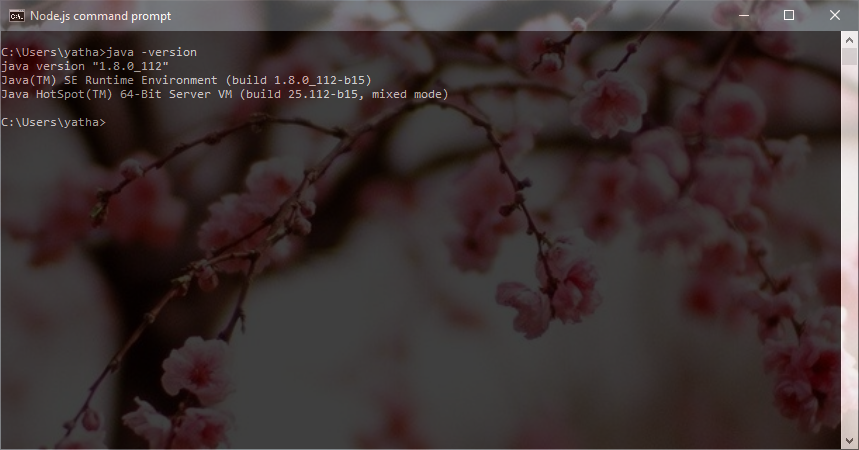

# Apply ACLs recursively, Upload files/folders from local machine to ADLS 

This utility allows users to:

	a. recursively apply ACLs to their folders & files in [Azure Data Lake Store](https://docs.microsoft.com/en-us/azure/data-lake-store/data-lake-store-overview). The tool is purpose built to solve the specific problem of applying recursive ACLs and in the future we plan to integrate this into our SDKs and CLI tools.

	b. Upload files/folders from local machine to ADLS. The tool employs multiple threads to upload data thus providing high throughput. 

You can download the latest version of this tool from [here](http://aka.ms/adlstool-download) 

## Pre-Requisites 

To use this tool, it is best to have the following information and setup. If you are not familiar with these concepts, refer to the step by step guide section below. 

* Installation of Java on the machine where this tool is run. You can find installation instruction for Java [here](https://www.java.com/en/download/help/download_options.xml)

* Information related the Service Principal (Object ID, Password) & the OAUTH 2.0 Token endpoint for the subscription. 

* Azure Data Lake store is an HDFS file system. Understanding of the ACLs in HDFS and how ACL strings are constructed is helpful. Example: "user::rwx,user:foo:rw-,group::r--,other::---" You can read more about it [here](https://hadoop.apache.org/docs/r2.6.3/api/org/apache/hadoop/fs/permission/AclEntry.html)

* Object IDs for the users, groups or service principals who need be part of the ACL entry, these ObjectIDs can be obtained from the portal or one of the Azure CLIs. 

* Ensure that you have the right persmissions to run this tool. Only users and service principals that are the [owning user](https://docs.microsoft.com/en-us/azure/data-lake-store/data-lake-store-access-control#the-owning-user) of the files and folders can apply ACLs to the file and folders in the account. Additionally [super-users](https://docs.microsoft.com/en-us/azure/data-lake-store/data-lake-store-access-control#the-super-user) have RWX permissions to all files & they can change permissions on any file. 


## Installing the tool 

The ADLS tool is available for both Windows and Linux, you can download the tool from [here](http://aka.ms/adlstool-download). Once donwloaded, unzip the contents of the file. They contents contain that Java JAR file used by the tool and helper scripts for both Window and Linux. We recommand that you use this tool from a VM located in the same region as your ADLS account for best performance. 

## Command line options

```
ADLS Java command-line tool
Usage:
  adlstool <modifyacl|removeacl> <credfile> <path> "<aclspec>"
  adlstool upload <credfile> <sourcePath> <destinationPath> [overwrite]

Where <credfile> is the path to a java property file that contains the following properties:
  account= fully qualified domain name of the Azure Data Lake Store account
  credtype= the type of credential; one of clientcredentials or refreshtoken

For clientcredentials, provide these three values:
  authurl= the OAuth2 endpoint from AAD
  clientid= the application ID
  credential= the (secret) key

For refreshtoken, provide these two values:
  clientid= the ID of the user
  refreshtoken= the refresh token

For upload:
  sourcePath= Absolute path of the file/folder to be uploaded into ADLS.
  destinationPath= Path on ADLS, where the source file/folder has to be copied. The destinationPath has to be a directory under which the source file/folder is copied.
  overwrite= Optional paramter. Specify overwrite, if destination files with the same names should be overwritten

```

The step by step guide below, walkthrough how to use this tool in detail and how to obtain the right set of inputs used by the tool. 


## Step by Step guide  

In our Sample walkthrough

1. we have an Azure Data Lake Store account with over a million files and folders under the directory "rectest". Our goal of this exercise is to modify ACLs on each of these files and folders by adding read and execute permissions for a user.

2. Upload data.txt file on local machine to ADLS.


In this workflow, we use the [Azure Portal](https://azure.microsoft.com/en-us/features/azure-portal/) and the [Azure CLI 2.0](https://docs.microsoft.com/en-us/cli/azure/overview) to obtain the necessary information required to run this tool. If you don't have the Azure CLI 2.0 installed, you can follow the instructions [here](https://docs.microsoft.com/en-us/cli/azure/install-azure-cli) to install it. Both these tools are used to get the relevant information needed and create a service principal in the right role, if you already have a service principal, you can skip that section. You can also obtain the information needed through alternate methods, we chose the portal and CLI 2.0 because both of these are platform independent. 

### Setting up the environment

1. If you don't have Java installed, install Java from [here](https://www.java.com/en/download/help/download_options.xml)

2. To check if you have Java installed and in your path, run 'java -version' from your terminal/shell/command prompt. You should see output similar to below. 



> If you have installed Java but the cannot run Java, check to make sure that the bin directory containing Java is in your path. 

### Gathering the right information 

In order to run the tool, you need some information to get started including service principal, OAUTH 2.0 token endpoint, Data Lake Store account URL, path of the folder. 

#### Service Principal 

We will use a Service Principal to to allow the tool to access the Azure Data Lake Store account, this service principal needs to be an owner for the ADLS account in order to perform the operation of applying ACLs or upload data. If you already have a service principal - note down the "ApplicationID" and the "Password" for the service principal. 

To create a Service Principal from the Azure CLI 2.0, ensure that you have the CLI 2.0 installed on your machine. From a terminal/shell/command prompt run 

```
az login
```
and complete the login with your credentials associated with the tenant in which you have the ADLS account, once you've successfully logged in run 

```
az ad sp create-for-rbac -n <give it a name> --role owner
```

Once the command runs successfully, save the information generated, we will use this in creating the credential file. 


From the Azure Portal, you can check that the service prinicpal has the right role for your ADLS account. 


#### Obtaining the OAUTH 2.0 Token

1. Sign on to the new [Azure portal](https://portal.azure.com) and click Active Directory from the left pane.

2. From the left pane, click **App registrations**.

3. From the top of the App registrations blade, click **Endpoints**.

	

4. From the list of endpoints, copy the OAuth 2.0 token endpoint.


	 

5. Save this Token and we will use this token in the section when we are creating the credential file.   

### Creating the credentials file 

We've now gathered all the information that we need to create a credential file that will be used by the tool. To get started, create a new text file from any text editor on your platform and enter the following

```
account=<Fully Qualified Domain Name for your Azure Data Lake Store account
credtype=clientcredentials
clientid=<App ID from your service principal>
credential=<password for your service principal>
authurl=<OUTH 2.0 Token Endpoint for your Tenant>
```


Save this file in the same directory as the .jar file for the tool and name it newcred.cred

### Creating the ACLSPEC string

In order to apply ACLs, we will need an ACLSPEC string to pass on to the tool. Azure Data Lake Store uses POSIX style ACLs, you can read more about that [here](https://docs.microsoft.com/en-us/azure/data-lake-store/data-lake-store-access-control). The ACLSPEC string can be specified in the following format

```
 '[default:]user|group|other:[entity id or UPN]:r|-w|-x|-,[default:]user|group|other:[entity id or UPN]:r|-w|-x|-,...'. 
```

To create this string, we first need the objectID of the user that we are going to add an ACL entry for. This can be obtained from Azure Portal or from the Azure CLI 2.0 by running the following command if you know the name of the user. 

```
"az ad user list --display-name "<User's Display Name>"
```


To get properties of users, security groups, service principals you can either use the Azure CLI 2.0 documented [here](https://docs.microsoft.com/en-us/cli/azure/ad)

Once you have this information, you need to decide what permission you want to give, in this walkthrough, we can going to give the user Read and Execute permissions, putting this information in the ACLSPEC string format we get. 

```
user:c1cdf024-1a48-41a9-ad14-c1f262b0cfec:r-x
```

We will use this string in running the tool. 


### Running the Tool

We now have all the information needed to run the tool. From a Terminal/Shell/Command Line on your computer, run 

```
adlstool modifyacl newcred.cred "\rectest2" user:c1cdf024-1a48-41a9-ad14-c1f262b0cfec:r-x
```
Please make sure to use the group qualifier when you are adding an AAD group to the ACL and the user qualifier when you are adding a user identity (end user or Service Principal). In general , we recommend that you use groups in your ACLs as a best practice, for more information, please visit the [Best practices section](https://azure.github.io/data-lake-adlstool/doc/#best-practices--faq) of this document.

You can also specify multiple access ACLs and multiple default ACLs together in one run. For example, we can also apply the default ACLs of r-x for group c1cdf024-1a48-41a9-ad14-c1f262b0cfec as shown below

```
adlstool modifyacl newcred.cred "\rectest2" "user:c1cdf024-1a48-41a9-ad14-c1f262b0cfec:r-x,default:user:c1cdf024-1a48-41a9-ad14-c1f262b0cfec:r-x"
```
Once the tool successfully completes, you ACLs have been applied, we expected <10 mins to apply ACLs to ~ 1 million objects. You can use the Azure Portal to verify that the ACLs have been set by check a sample of file and folders in your path. 
```
adlstool upload newcred.cred /local/data.txt /home 
```
This copies data.txt file in the local machine to ADLS under /home directory.

```
adlstool upload newcred.cred /local/ /home 
```
This copies the entire directory and its subdirectories into ADLS under /home/ directory.

When a large file is being uploaded, the tool will write data into multiple chunks on ADLS. These chunks are temparory and are placed at
{dirname}/{filename}-segments-uuid/{filename}-id. If upload fails for any reason, these folders has to be removed by the user.

## Best Practices & FAQ

**Performance** For best performance, we recommend runningitg this tool in an Azure VM that is in the same region your Azure Data Lake Store Account. This tool creates multiple threads on the client and then executes commands on each of those threads to set ACLs on every file. This latency of access to the Azure Data Lake Store account will determine the performance (in the time domain) of the tool. 

**Credentials** We recommend using a Service Principal as the authentication mechanism, ideally you want to scope the Role of the Service Principal to just your ADLS account to ensure the highest security. 

**ACL Limits** This is maximum limit to the number of ACLs that you can apply to a file/folder. At the time of publishing this document, it is limited to 32 access ACLs and 32 default ACLs. You can find the most current documentation about this [here](https://docs.microsoft.com/en-us/azure/azure-subscription-service-limits#data-lake-store-limits)

**Handling run-time Errors** It is possible that the tool may fail while running, this may happen because we had an outage or more likely that something went wrong on your client machine, such as - machine went to sleep, machine lose internet connectivity. The tool is designed to stop at first failure. The best practice for the recovery is to re-run the tool with the same options. If an ACL has already been applied, re-applying that same ACL won't have any negative impact. 

**403 Errors** If you see HTTP403 AccessControlExceptions


> 

> Check the following, they are the most common reasons for these errors. 

>**(a)** The service principal or object associated with the credentials that you are are providing the tool to run, are set to the "Owner" role for the Azure Data Lake Store account. Service principals or users "Contributor" or other roles cannot change ACLs. 

>**(b)** If your Azure Data Lake store account has a Firewall turned on, you will need to explicity allow the IP address of the client where you are running the tool. Please refer [here](https://docs.microsoft.com/en-us/azure/data-lake-store/data-lake-store-secure-data) for more information on firewall settings. 
